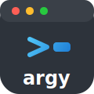

<p align="center">
  
</p>

<p align="center">
  <a href="LICENSE">
    
  </a>
  <a href="https://github.com/mshenoda/argy/actions/workflows/ci-linux.yml">
    
  </a>
  <a href="https://github.com/mshenoda/argy/actions/workflows/ci-windows.yml">
    
  </a>
  <a href="https://github.com/mshenoda/argy/actions/workflows/ci-macos.yml">
    
  </a>
</p>

## Argy

**Effortless Command-Line Parsing for Modern C++**  
*Because life’s too short to parse argv by hand!*

A modern, header-only C++17 argument parser that makes CLI development a breeze.

*If you love Python's argparse or click, you'll feel right at home—argy brings that developer-friendly style to C++.*


## Features
- 📦 **Header-only** & zero dependencies
- 🧩 **Intuitive API** for defining and parsing command-line arguments
- 🎯 Supports positional, optional, and flag arguments
- 🔒 **Type-safe** access to parsed values
- 📝 Customizable help output
- 🛠️ Modern, chainable API

## Installation

There are several ways to use argy in your project:

- **With CMake (FetchContent) (Recommended):**
  ```cmake
  include(FetchContent)
  FetchContent_Declare(
    argy
    GIT_REPOSITORY https://github.com/mshenoda/argy.git
    GIT_TAG        main # or a specific tag/release
  )
  FetchContent_MakeAvailable(argy)
  target_link_libraries(your_target PRIVATE argy)
  ```

- **With CMake (add_subdirectory):**
  First, clone the repository:
  ```sh
  git clone https://github.com/mshenoda/argy.git
  ```
  Then, in your CMakeLists.txt:
  ```cmake
  add_subdirectory(argy)
  target_link_libraries(your_target PRIVATE argy)
  ```

- **Header-only (any project type):** Simply copy the `include/argy.hpp` file into your project.

## API Usage

### Template Methods
Define arguments and access them with the template API:
```cpp
#include "argy.hpp"
using namespace std;
using namespace Argy;
Parser args(argc, argv);
args.add<string>("image", "Path to input image");            // Positional argument 
args.add<string>("-m", "--model", "Path to model weights");  // Named string argument, without default (required) 
args.add<float>("-t", "--threshold", "Detection threshold", 0.5f); // Named float argument, with default
args.add<bool>("--visualize", "Show detection results");   // Named bool argument
args.add<Ints>("--input-size", "Input size", Ints{640, 480});     // Named vector<int> argument, with default
```

### Named Convenience Methods
Use named methods for clarity:
```cpp
using namespace std;
using namespace Argy;
Parser args(argc, argv);
args.addString("image", "Path to input image");   // Positional argument 
args.addInt("-n", "--num-classes", "Number of classes", 80);  // Named int argument, with default
args.addBool("-s", "--save-vis", "Save visualization images"); // Named bool argument
```

### Chaining Methods
Chain argument definitions for a fluent API:

// Template method chaining
```cpp
using namespace std;
using namespace Argy;
Parser args(argc, argv);
args.add<string>("image", "Path to input image")
    .add<string>("-m", "--model", "Path to model weights")
    .add<float>("-t", "--threshold", "Detection threshold");
```

// Named convenience method chaining
```cpp
using namespace std;
using namespace Argy;
Parser args(argc, argv);
args.addString("image", "Path to input image")
    .addInt("-n", "--num-classes", "Number of classes", 80)
    .addBool("-s", "--save-vis", "Save visualization images");
```

### Parsing and Accessing Arguments
Typical usage pattern:
```cpp
try {
    args.parse();
    auto image = args.get<string>("image");
    auto threshold = args.get<float>("threshold");
} catch (const exception& ex) {
    cerr << "Error: " << ex.what() << '\n';
    args.printHelp(argv[0]);
    return 1;
}
```

## Full Examples

### Full example using template methods
```cpp
#include <iostream>
#include <string>
#include <vector>
#include <exception>
#include "argy.hpp"
using namespace std;
using namespace Argy;

int main(int argc, char* argv[]) {
    Parser args(argc, argv);
    try {
        // add arguments
        args.add<string>("image", "Path to input image");
        args.add<string>("-m","--model", "Path to model");
        args.add<float>("-t","--threshold", "Detection threshold", 0.5f);
        args.add<bool>("-v", "--visualize", "Visualize results");
        args.add<Ints>("-i","--input-size", "Input size", Ints{640, 480});
        args.add<string>("-o","--output", "Output directory", "results/");
        args.add<int>("-n", "--num-classes", "Number of classes", 80);
        args.add<bool>("-s", "--save-vis", "Save visualization images");
        args.add<Floats>("-n","--norm", "normalization values", Floats{0.48f, 0.45f, 0.40f});

        // parse arguments
        args.parse();

        // get parsed arguments
        auto image = args.get<string>("image");
        auto model = args.get<string>("model");
        auto threshold = args.get<float>("threshold");
        auto visualize = args.get<bool>("visualize");
        auto inputSize = args.get<Ints>("input-size");
        auto output = args.get<string>("output");
        auto numClasses = args.get<int>("num-classes");
        auto saveVis = args.get<bool>("save-vis");
        auto meanValues = args.get<Floats>("mean");

        // use the arguments...
    } catch (const exception& ex) {
        cerr << "Error: " << ex.what() << '\n';
        args.printHelp(argv[0]);
        return 1;
    }
    return 0;
}
```

### Full example using named convenience methods
```cpp
#include <iostream>
#include <string>
#include <vector>
#include <exception>
#include "argy.hpp"
using namespace std;
using namespace Argy;

int main(int argc, char* argv[]) {
    Parser args(argc, argv);
    try {
        // add arguments
        args.addString("image", "Path to input image");
        args.addString("-m","--model", "Path to model");
        args.addFloat("-t","--threshold", "Detection threshold", 0.5f);
        args.addBool("-v", "--visualize", "Visualize results");
        args.addInts("-i","--input-size", "Input size", Ints{640, 480});
        args.addString("-o","--output", "Output directory", "results/");
        args.addInt("-n", "--num-classes", "Number of classes", 80);
        args.addBool("-s", "--save-vis", "Save visualization images");
        args.addFloats("-n","--norm", "normalization values", Floats{0.48f, 0.45f, 0.40f});

        // parse arguments
        args.parse();

        // get parsed arguments
        auto image = args.getString("image");
        auto model = args.getString("model");
        auto threshold = args.getFloat("threshold");
        auto visualize = args.getBool("visualize");
        auto inputSize = args.getInts("input-size");
        auto output = args.getString("output");
        auto numClasses = args.getInt("num-classes");
        auto saveVis = args.getBool("save-vis");
        auto meanValues = args.getFloats("mean");

        // use the arguments...
    } catch (const exception& ex) {
        cerr << "Error: " << ex.what() << '\n';
        args.printHelp(argv[0]);
        return 1;
    }
    return 0;
}
```

## Example Help Output

Argy prints a help message when you run your program with `--help` or `-h`, or call `args.printHelp(argv[0]);`. The actual output will be colorized and bold in supported terminals. Here is the plain text of help message:

```
Usage: ./my_program <image> [options]

Positional:
  image              Path to input image       (required)

Options:
  -m, --model        Path to model             (required)
  -t, --threshold    Detection threshold       (default: 0.5)
  -v, --visualize    Visualize results         (default: false)
  -i, --input-size   Input size                (default: 640, 480)
  -o, --output       Output directory          (default: results/)
  -n, --num-classes  Number of classes         (default: 80)
  -s, --save-vis     Save visualization images (default: false)
  -m, --mean         Mean normalization values (default: 0.48, 0.45, 0.40)
  -h, --help         Show this help message
```

> **Note:** The actual output in your terminal will be colorized and bold if ANSI colors are supported.

## Argument Requirements

- Positional arguments (those without dashes) are always **required** and cannot have default values.
- Named arguments are **required** by default, but become **optional** if you specify a default value.
- Flag arguments (e.g., `--save-vis`) do not require a value; their presence sets them to `true`.

## Contributing
Contributions are welcome! Please open issues or pull requests for bug fixes, features, or improvements.

## Citation

If you use this project in your research, please cite it as follows:

```bibtex
@misc{mshenoda_argy,
  author = {Michael Shenoda},
  title = {Argy: Effortless Command-Line Parsing for Modern C++},
  year = {2025},
  url = {https://github.com/mshenoda/argy},
  note = {Author website: https://mshenoda.com}
}
```
